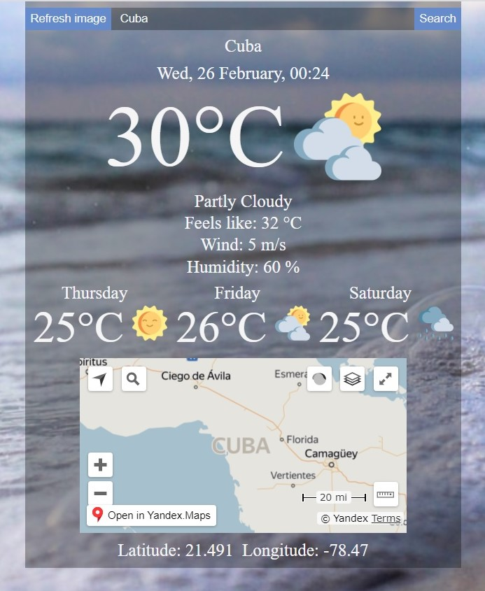

# [Weather-App](https://weather-app-vp090391.netlify.com/)
Weather forecast application consisted of weather forecast for today and for 3 days, geolocation data, changeable background image.

Vanilla JS, responsive layout, search field, JS code into modules, WebPack, Dark Sky API, ipinfo.io API, Unsplash API, API Yandex Map, Yandex.Maps Geocoding.

